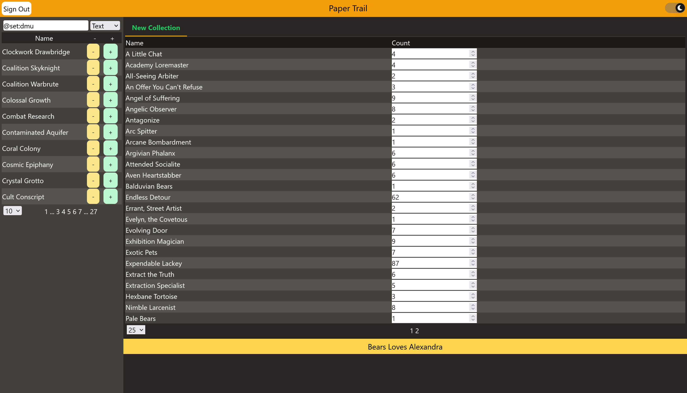

# codename paper-trail

A SvelteKit based Magic the Gathering Collection Tracker.

Using Redis for lighting fast card queries.

Using Postgres for user information and storage.

Using TailwindCSS for styling and Skeleton for components.

Card info comes from the scryfall api.

